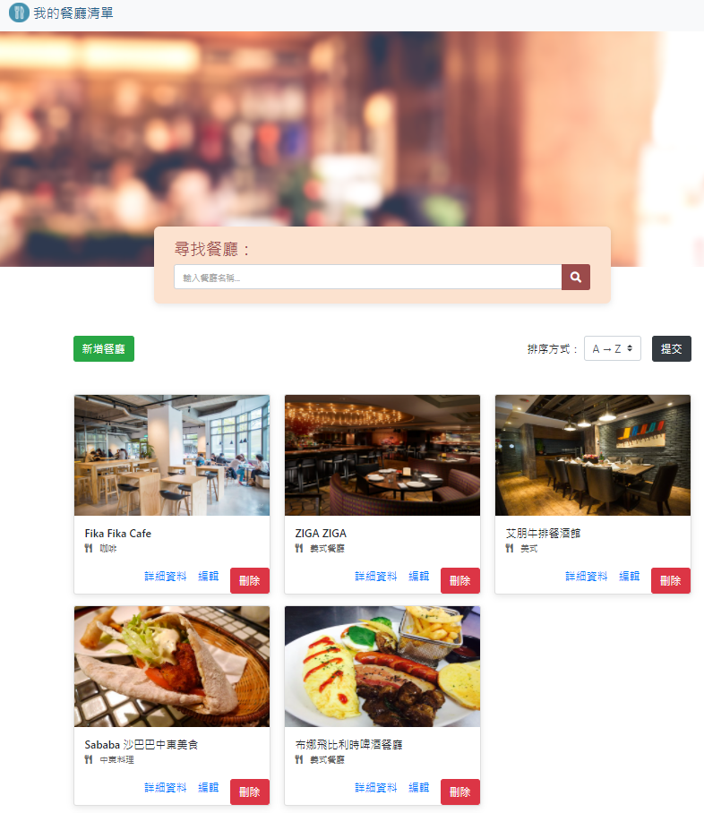

# Restaurant List

AlphaCamp Project: Restaurant-List
使用Node.js、Express、Mongoose等開發工具所打造的網站。

## 網站主要功能

- 使用者可在首頁看到所有餐廳資料及各項功能。
- 使用者可點擊詳細資料以查看餐廳資訊：類別、地址、電話、描述、圖片。
- 使用者可點擊編輯對特定餐廳資料進行修改。
- 使用者可點擊刪除以移除特定餐廳。
- 使用者可點擊新增以填寫餐廳資料，並新增該餐廳資料至首頁。
- 使用者可輸入關鍵字以查詢餐廳名稱。
- 使用者可提交表單使餐廳資料以希望之排序方式呈現。
- 使用者在任何頁面皆可點擊左上角「我的餐廳清單」以回到餐廳首頁。

## 專案畫面截圖


## 開發環境

- Visual Studio Code
- Express
- Express-Handlebars
- MongoDB
- mongoose
- nodemon
- body-parser
- method-override

## 安裝專案

### 1. 開啟終端機，Clone此專案至本機

```
git clone https://github.com/HowNLuo/Restaurant-List.git
```

### 2. 終端機輸入以下指令進入專案

```
cd restaurant-list
```

### 3. 終端機輸入以下指令以安裝npm套件

```
npm install
```

### 4. 加入種子資料

```
node models/seeds/restaurantSeeder.js
```

### 5. 終端機輸入以下指令啟動伺服器

```
npm run dev
```

### 6. 請至瀏覽器輸入 http://localhost:3000 開始使用網站

## 專案開發人員

> [HowNLuo](https://github.com/HowNLuo)